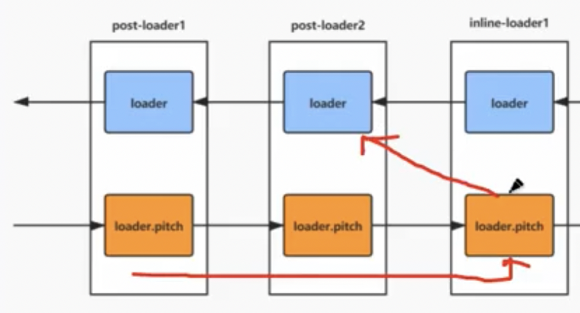
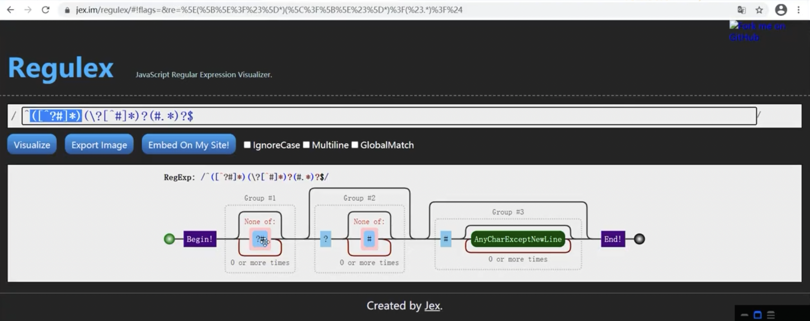

1. 为什么说loader的执行是从右向左,从下向上

2. 为什么要分成四种loader?顺序不同，可以通过enforce来指定顺序
loader类型不同会决定执行顺序的，因为loader的配置是分散的,它可能会由多个配置文件合并而来
> 像eslint要先执行，因为babel编译完在检查就没意义了

如何实现的？


如果pitch中返回：



```js
normal.pitch = function(remainingRequest,previousRequest,data){
    return 'inline1-pitch'
}
```


注意：

最左边的loader返回值只能是JS代码。因为它的返回值是给webpack.webpack是要用它生成JS AST
其它的loader 返回值没有要求,可以是任意的内容,但是需要下一个 loader能处理


使用自定义loader方法:配置如何查找loader
1. alias
```js
resolveLoader: {
  alias: {
    'babel-loader': path.resolve('./core/babel-loader.js')
  },
  module: {
    rules: [
      {
        test: /\.js$/,
        use: ['babel-loader']
      }
    ]
  }
},
```
2. modules
```js
resolveLoader: {
  modules: [path.resolve('./babel-loader.js'), './core'] // 先从第一个参数找，找不到再从第二个参数找
},
```
3. 绝对路径
```js
module: {
  rules: [
    {
      test: /\.js$/,
      use: [path.resolve(__dirname, './core/babel-loader.js')]
    }
  ]
}
```

解析 PATH_QUERY_FRAGMENT_REGEXP = /^([^?#]*)(\?[^#]*)?(#.*)?$/;




